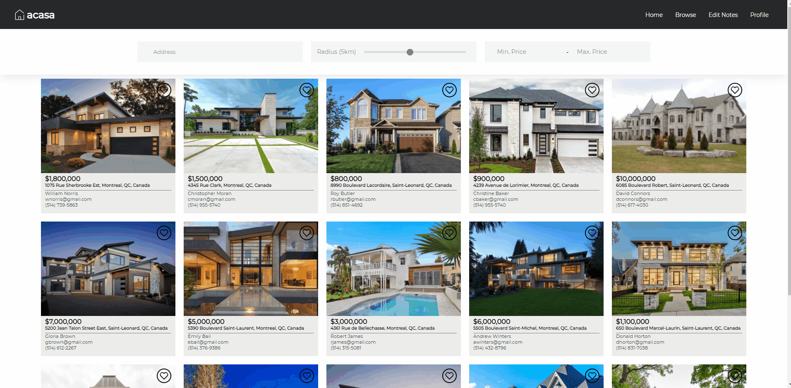
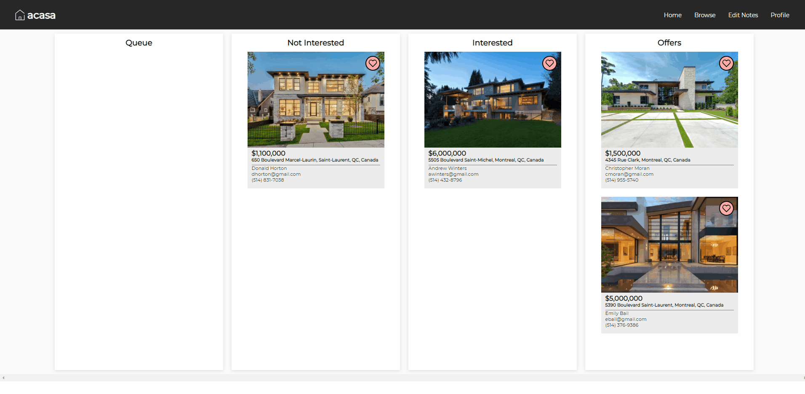
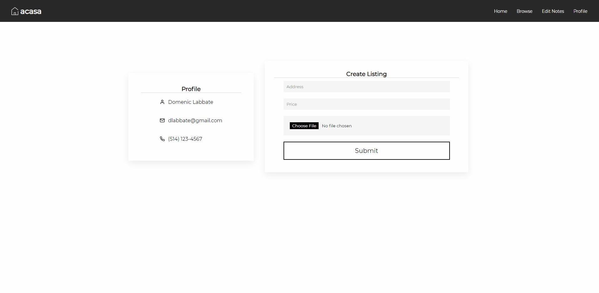
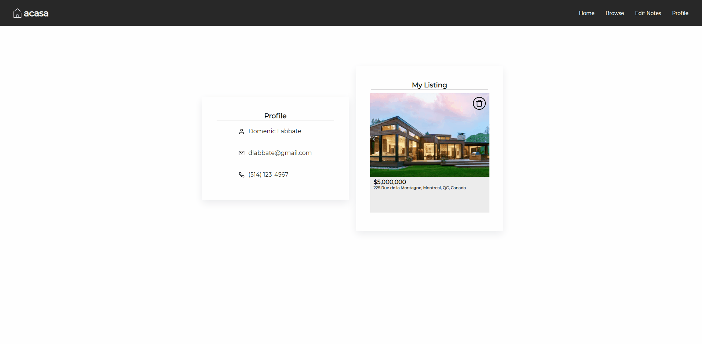

# Acasa
#### *Your dream home is only a few clicks away!*

 

## Overview
Acasa is a simple to use real estate platform that offers the ability to search for homes, organize favorites into different categories, and even create your own listing!

 

## Features
🔎 Filter listings by **location** (using Google Maps API), **radius**, and **price**

❤️ Add listings to favorites

❌ Remove listings from favorites

📁 Organize listings into different categories (Drag and Drop)

🏡 Create your own listing

🗑️ Delete your listing

 

## Tech Stack
### Frontend
   

### Backend
   

### Testing
 

### Libraries/API
Name | Overview | Link
:--- | :--- | :---
`Google Maps` | Google Maps API used for searching locations + autocomplete | https://github.com/hibiken/react-places-autocomplete
`bcrypt` | Encrypted user password with hashing + salt | https://github.com/kelektiv/node.bcrypt.js/
`jsonwebtoken` | JSON Web Tokens used for route protection | https://github.com/auth0/node-jsonwebtoken
`react-beautiful-dnd` | Drag and drop for lists with React | https://github.com/atlassian/react-beautiful-dnd

 

## Tutorials

### Browse Page
###### Search for listings with the option to filter by 📍 Location, 🌐 Radius, and 💸 Price 

***

### Add To Favorites

***

### Notes Page
###### Drag and drop listings into the following categories: Queue (by default, favorited listings are placed here), Not Interested, Interested, Offers

***

### Remove From Favorites

***

### Create Listing
###### Create your own listing! (A user can only have one active listing at a time)

***

### Delete Listing
###### Delete your listing when it gets sold!

## Architecture

### UML
The overall structure consists of the following models:
* `User`
* `Listing`
* `Note`
* `Column`
* `Board` (where a user organizes notes. For instance, reordering, moving to a different column, etc.)
 

***

### Frontend
Frontend uses an API module pattern. In particular, JS modules that contains HTTP logic organized by business domain (namely `User`, `Listing`, `Note` and `Board`).
 

***

### Backend
Backend structured using a layered approach in order to organize logic.
 

